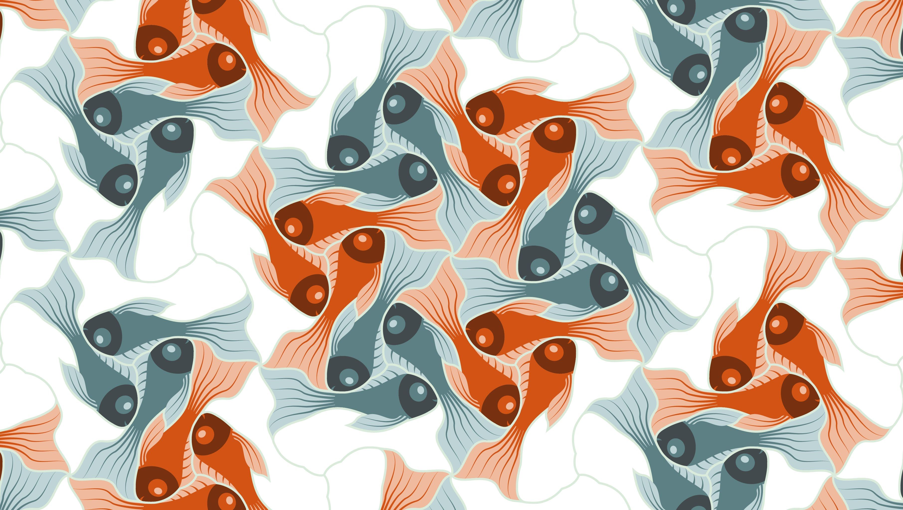

# Day 02

## Grids and patterns

### Escher tessellations

Maurits Cornelis Escher(17 June 1898 – 27 March 1972) was a Dutch graphic artist who made woodcuts, lithographs, and mezzotints, many of which were inspired by mathematics. Despite wide popular interest, for most of his life Escher was neglected in the art world, even in his native Netherlands. He was 70 before a retrospective exhibition was held. In the late twentieth century, he became more widely appreciated, and in the twenty-first century he has been celebrated in exhibitions around the world.

### My exemple


<iframe src="content/day02/01/embed.html" width="100%" height="450" frameborder="no"></iframe>



<iframe src="content/day02/02/embed.html" width="100%" height="450" frameborder="no"></iframe>
